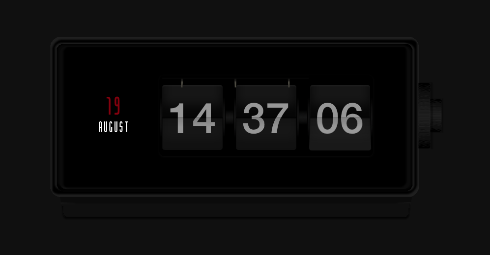

<p align="center"></p>

<div align="center">
<a href="https://github.com/himanshu-matharu/daily-countdown/releases">

</a>
<a href="https://github.com/himanshu-matharu/daily-countdown/blob/master/LICENSE">

</a>
</div>

## Website Link
The live website can be found <a href="https://daily-countdown.web.app">here</a>.

# Description
This is a beautiful daily countdown timer that counts down to the end of the day. It is a great productivity tool that I personally use. Consider it like a 24-hour pomodoro timer that keeps you focused and motivated throughout the day that updated everyday automatically.

UI of the app is based on an illustration of Braun Phase 2 flip clock by Dietrich Lubs by <a href="https://dribbble.com/shots/15004293-Braun-Phase-2-Flip-Clock?utm_source=Clipboard_Shot&utm_campaign=colaja&utm_content=Braun%20Phase%202%20Flip%20Clock&utm_medium=Social_Share&utm_source=Clipboard_Shot&utm_campaign=colaja&utm_content=Braun%20Phase%202%20Flip%20Clock&utm_medium=Social_Share">Nikola Lazarevic</a>.

The Figma design file can be found <a href="https://www.figma.com/file/yrqWvzRWeabNfPFPTCT36p/Braun-Countdown-Clock?node-id=0%3A1">here</a>.

<div>

</div>

# Tech Stack and Resources
A brief high-level overview of the tech stack used:
- The web app is developed using React.
- The flip countdown component is from the flip plugin available <a href="https://github.com/pqina/flip/">here</a>.
- All the UI styling is done using SVG assets created on Figma and CSS.
- The custom font used is <a href="https://www.dafont.com/chingolo-pro.font">Chingolo Pro</a> and is included in the project in the src/fonts folder.

# Installation

1. Clone the repo
```git
git clone https://github.com/himanshu-matharu/daily-countdown.git
```
2. Run npm install in the project directory to install the required dependencies.
```node
npm install
```
3. Run the project.
```node
npm start
```

# License
The Daily Countdown Timer web app is free and open-source software distributed under the MIT License. See the <a href="https://github.com/himanshu-matharu/daily-countdown/blob/master/LICENSE">LICENSE</a> file for more details.

# Contact
For any queries, send me a mail on himanshumatharu1155@gmail.com
